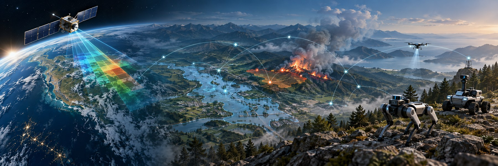

> *“With spatial intelligence, AI will understand the real world.”*  
> — **Fei-Fei Li**

My name is Yaoyi Qi, and I am currently studying at the School of Artificial Intelligence at Wuhan University. My research interests include computer vision, large multimodal models, intelligent agents, and spatiotemporal intelligence.

- **Education** — I received my B.Eng. in Electronic Information Engineering from the Electronic Information School (EIS), Wuhan University. I am currently pursuing a master's degree in Intelligent Science and Technology at the School of Artificial Intelligence, Wuhan University.
- **Research** — My research interests include computer vision, intelligent agents, multimodal large language models, and spatiotemporal intelligence. You can find my publications on [Google Scholar](https://scholar.google.com/citations?user=8J6XFdYAAAAJ&hl=en).
- **Reading & Notes** — I share recent research that I am following, ongoing work, and study notes on my [CSDN Blog](https://blog.csdn.net/qq_73553710).
- **Contact** — Feel free to reach me at [qiyaoyi@whu.edu.cn](mailto:qiyaoyi@whu.edu.cn).
